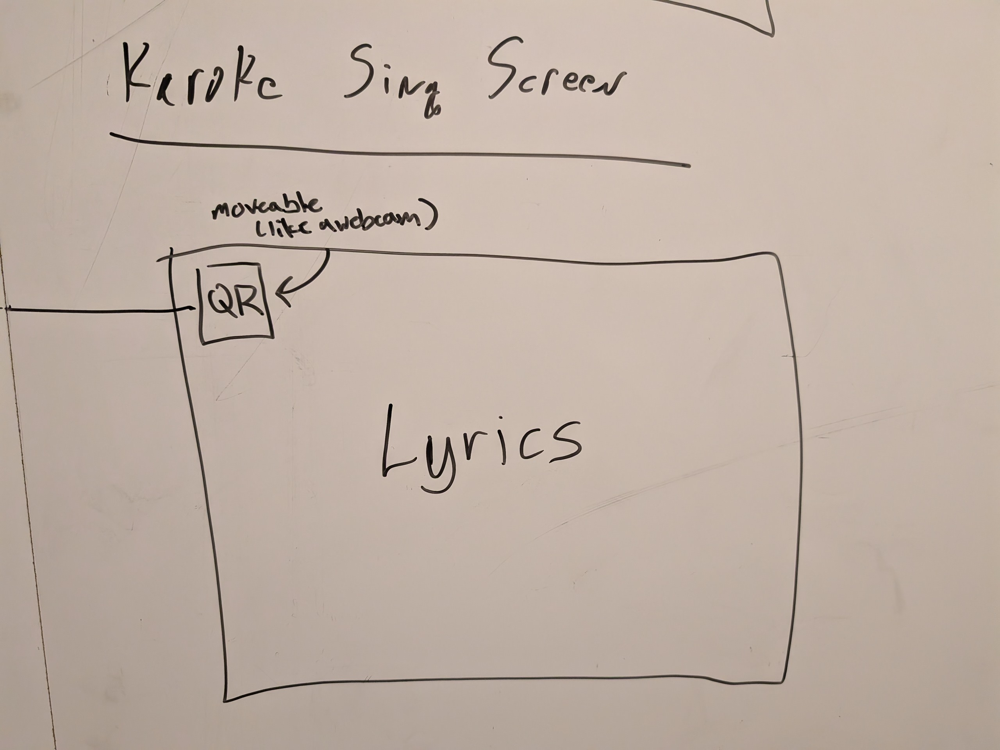
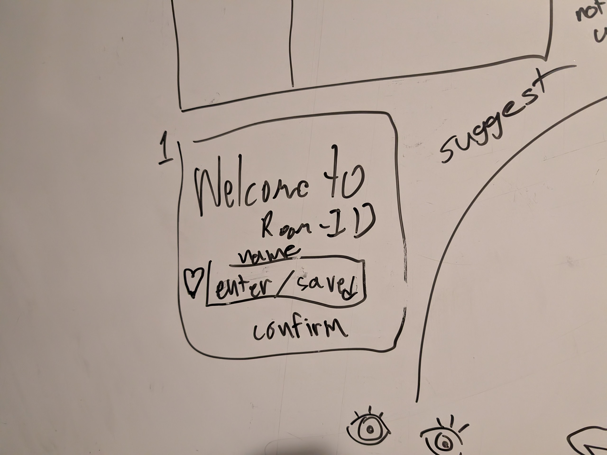
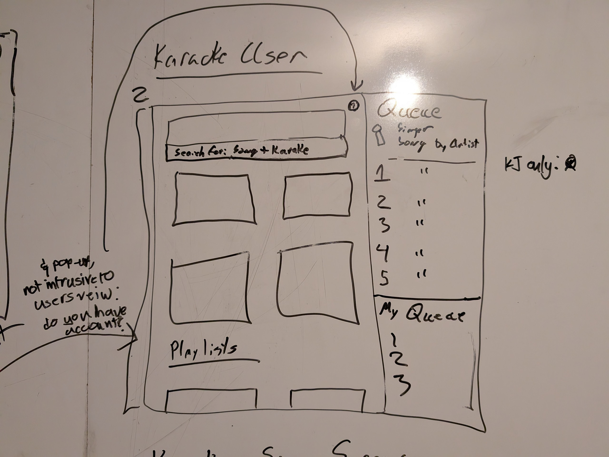
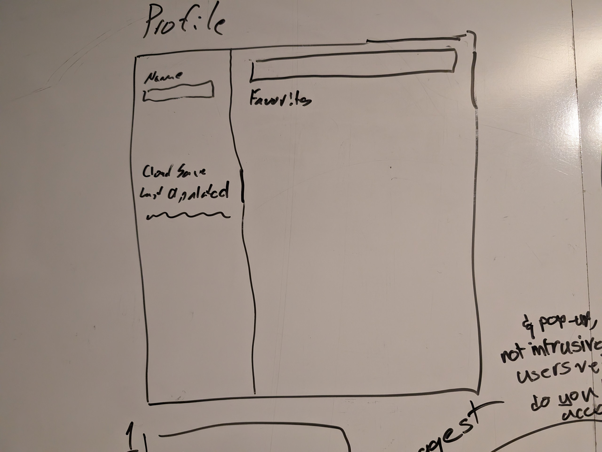

# UI Design

This document outlines the high-level screens and reusable components for the Karaoke MN frontend.

## Screens

### Full-Screen Video (TV View)
A full-window video player with an unobstructed view of the karaoke playback.
  - Overlay in the top-right corner:
    - **Room Code** (e.g. `PURPLE-RAIN`) in large, legible text.
    - **Join URL/QR Code** with a semi-transparent backdrop for scanability.
  - Player controls (play/pause, progress bar) auto-hide after a few seconds of inactivity.
  - Persistent footer or corner watermark with the guest-facing join link (e.g. `karaoke.example.com`).
### Login / Splash Screen
A clean entry screen that handles both KJ and guest login flows:
  - Detects WebAuthn passkey registration and an existing StageName in localStorage.
  - If recognized, performs silent authentication and navigates to the search interface.
  - Otherwise, presents a simple form:
    - Text input for **Stage Name** (your display name on-screen).
    - **Register / Confirm** button to set up passkey authentication and save your StageName.
  - Displays friendly error or guidance (e.g. “Tap your security key” or “Enter a name to get started”).
### Main Search Screen
The core guest-facing screen with search and queue overview:
  - Header with **StageName** edit icon and **Cloud Save** timestamp.
  - `<search-bar-with-status>`: debounced input that appends “karaoke” and shows normalized query below.
  - `<toggle-view-button>`: lets users switch between compact list and cover‑art grid.
  - `<search-results-list>`: displays video thumbnails, titles, and an “Add to queue” button.
  - `<popover-queue>`: slide‑out panel on the right showing:
    - Upcoming singers (current + next 5) and their song titles.
    - Highlight of your personal queued songs at the bottom.
### User Profile Screen
A personalized library and profile management view:
  - Inline editable **StageName** in the page header.
  - **Cloud Save** badge indicating when your favorites were last synced.
  - `<search-bar-with-status>` for quick filtering of your saved songs.
  - `<toggle-view-button>` to choose grid or list view of favorites.
  - `<search-results-list>` showing your bookmarked karaoke favorites with options to remove.

## Reusable Components

### `<login-form>`
- Text input for StageName (guest display name).
- Confirm button to register passkey and save the StageName locally.

### `<search-bar-with-status>`
- Text input and search button (height-matched).
- Non-editable status display showing the normalized query.

### `<toggle-view-button>`
- Toggles between grid and list layouts for search/favorites results.

### `<popover-queue>`
- Full-height side panel displaying queued singers:
  - Top 75%: current singer + next five singers (song title, artist, StageName).
  - Bottom 25%: the current user's queued songs.

---
## Screenshots (Rough Mockups)

### Full-Screen Playback

### Login Splash Screen

### Main Search Page

### User Profile Page
